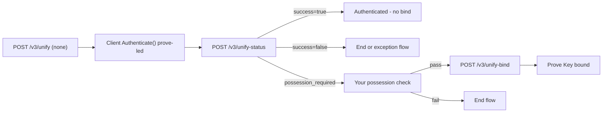

import Tabs from '@theme/Tabs';
import TabItem from '@theme/TabItem';
import Callout from '@site/src/components/Callout';

Use this guide to integrate **prove passive authentication with customer-supplied possession fallback** for **Human Assurance**.

The client runs **Mobile Auth and OTP**, and your server polls **`POST /v3/unify-status`**. Call **`POST /v3/unify-bind`** only when status is **`possession_required`** and your possession check passes.

For client setup, see Human Assurance Prove possession web, Android, or iOS. For customer-only possession, see Human Assurance customer-supplied possession with force bind. For product context, see Human Assurance overview.

<Callout type="info">
**Prove passive authentication with customer-supplied possession fallback** requires **both** a **client-side SDK** and these **platform APIs**:

- `POST /v3/unify`
- `POST /v3/unify-status`
- `POST /v3/unify-bind`
</Callout>

## Prerequisites

- **SDK and credentials**: Install a Prove server SDK and configure Sandbox OAuth. See [Set up Prove SDKs in your project](https://papadewald86.github.io/portfolio/docs/how-to/dev-environment-sdk-setup).
- **Access token**: Obtain a bearer token using Prove OAuth. Use the same token for `POST /v3/unify`, `POST /v3/unify-status`, and `POST /v3/unify-bind`.
- **Server**: Use a Prove server SDK or call those endpoints directly. See the reference pages for full request bodies, optional fields, and responses.
- **Client SDK**: Install the web, Android, or iOS client SDK for **`Authenticate()`**, Mobile Auth, OTP, and Prove Key handling. Your product **Authenticate** navigation includes the matching **Prove possession** how-to for your channel.

## Flow overview

Start with **`POST /v3/unify`** using **`possessionType=none`**. The client runs **prove-led** possession. Your server polls **`POST /v3/unify-status`** after **`Authenticate()`** finishes. Branch on **`success`**:



Persist the **correlation ID** from **`POST /v3/unify`** for status and bind. Return **`authToken`** to the client for **`Authenticate()`**.

## Implementation steps

<Callout type="warning">
**Customer-supplied fallback and bind** apply when prove-led possession doesn't complete and **`POST /v3/unify-status`** returns **`possession_required`**, most often on **mobile channels**. Desktop web may complete through **Instant Link** with **`success=true`** and no bind. See [Sandbox testing](#sandbox-testing) for pass, fail, and fallback test users.
</Callout>

### 1. Determine client channel

Configure **`Authenticate()`** for the customer's surface before you call **`POST /v3/unify`**.

<Tabs>
<TabItem value="web" label="Web SDK">

On **mobile web**, configure Mobile Auth and OTP in **`Authenticate()`**. On **desktop web**, configure Instant Link. Use **`isMobileWeb()`** to branch:

```javascript
const authCheck = new proveAuth.AuthenticatorBuilder().build();
const isMobileWeb = authCheck.isMobileWeb();
```

</TabItem>
<TabItem value="android" label="Android SDK">

Use the mobile prove-led path, Mobile Auth with OTP fallback in **`ProveAuth.builder()`**.

</TabItem>
<TabItem value="ios" label="iOS SDK">

Use the mobile prove-led path, Mobile Auth with OTP fallback in **`ProveAuth.builder()`**.

</TabItem>
</Tabs>

### 2. Initialize the flow

Send the phone number and **`possessionType=none`** to your back end, then call **`POST /v3/unify`**. See `POST /v3/unify` for optional identifiers such as **`clientCustomerId`**, **`clientRequestId`**, and **`checkReputation`**.

<Tabs>
<TabItem value="go" label="Go">

```go
rspUnify, err := client.V3.V3UnifyRequest(ctx, &components.V3UnifyRequest{
  PhoneNumber:     provesdkservergo.String("2001004016"),
  PossessionType:  "none",
  ClientRequestID: "client-abc-123",
})
if err != nil {
  t.Fatal(err)
}
```

</TabItem>
<TabItem value="typescript" label="TypeScript">

```typescript
const rspUnify = await sdk.v3.v3UnifyRequest({
  phoneNumber: '2001004016',
  possessionType: 'none',
  clientRequestId: 'client-abc-123',
});
if (!rspUnify) {
  console.error('Unify error.');
  return;
}
```

</TabItem>
<TabItem value="java" label="Java">

```java
V3UnifyRequest unifyReq = V3UnifyRequest.builder()
  .phoneNumber("2001004016")
  .possessionType("none")
  .clientRequestId("client-abc-123")
  .build();

V3UnifyRequestResponse unifyReqResp = sdk.v3().v3UnifyRequest()
  .request(unifyReq)
  .call();

V3UnifyResponse unifyResp = unifyReqResp.v3UnifyResponse().get();
```

</TabItem>
<TabItem value="dotnet" label=".NET">

```csharp
var unifyReq = new V3UnifyRequest
{
  PhoneNumber = "2001004016",
  PossessionType = "none",
  ClientRequestId = "client-abc-123",
};

var rspUnify = await sdk.V3.V3UnifyRequestAsync(unifyReq);
```

</TabItem>
</Tabs>

Return **`authToken`** to the client for **`Authenticate()`**. Persist **`correlationId`** for **`POST /v3/unify-status`**. Expect **`success=pending`** while the client runs prove-led possession.

### 3. Authenticate

Once you have the `authToken`, build the authenticator for both the mobile and desktop flows. On desktop Instant Link, the SDK uses the **primary** role by default to register a Prove Key. Uncomment **`.withRole("secondary")`** in the sample only when you must skip Prove Key registration or verification on desktop devices.

<Tabs>
<TabItem value="web" label="Web SDK">

```javascript
async function authenticate(isMobileWeb, authToken) {
  // Set up the authenticator for either mobile or desktop flow.
  let builder = new proveAuth.AuthenticatorBuilder();

  if (isMobileWeb) {
    // Set up Mobile Auth and OTP.
    builder = builder
      .withAuthFinishStep((input) => verify(input.authId))
      // If support for AT&T carrier is required, pixel mode should be selected via
      // .withMobileAuthImplementation("pixel")
      // otherwise, "fetch" mode should be preferred by default
      .withMobileAuthImplementation("fetch")
      .withOtpFallback(otpStart, otpFinish);
  } else {
    // Set up Instant Link.
    builder = builder
      .withAuthFinishStep((input) => verify(input.authId))
      .withInstantLinkFallback(instantLink)
      // By default the SDK uses the primary role to register a Prove Key.
      // Uncomment the line below only to set the secondary role when you want to disable Prove Key registration or verification on desktop devices.
      // .withRole("secondary");
  }

  const authenticator = builder.build();

  // Authenticate with the authToken.
  return authenticator.authenticate(authToken);
}
```

<Callout type="warning">
Mobile Auth requires your Content Security Policy to allow Prove's endpoints on mobile web. If Mobile Auth silently never runs, check your CSP configuration first — see [Common failures](#common-failures) below.
</Callout>

</TabItem>
<TabItem value="android" label="Android SDK">

```java
// Object implementing AuthFinishStep interface
AuthFinishStep authFinishStep = new AuthFinishStep() {
  ...
};

// Objects implementing OtpStartStep/OtpFinishStep interfaces
OtpStartStep otpStartStep = new OtpStartStep() {
  ...
};

OtpFinishStep otpFinishStep = new OtpFinishStep() {
  ...
};

ProveAuth proveAuth = ProveAuth.builder()
    .withAuthFinishStep(authId -> verify(authId)) // verify(authId) call defined in #Validate the Mobile Phone section
    .withOtpFallback(otpStartStep, otpFinishStep)
    .withContext(this)
    .build();
```

The mobile data connection can sometimes be unavailable during testing. The `Builder` class offers a `withTestMode(boolean testMode)` method, which permits simulated successful session results while connected to a Wi-Fi network only. Testing using a Wi-Fi connection is useful in the Sandbox environment.

```java
ProveAuth proveAuth = ProveAuth.builder()
    .withAuthFinishStep(authId -> verify(authId))
    .withOtpFallback(otpStartStep, otpFinishStep)
    .withContext(this)
    .withTestMode(true) // Test mode flag
    .build();
```

The `ProveAuth` object is thread safe. You can use it as a singleton. Most Prove Auth methods are blocking and therefore can't execute in the main app thread. The app employs an executor service with a minimum of two threads to manage threads due to the ability to process concurrent blocking requests.

```java
public class MyAuthenticator {
    private final MyBackendClient backend = new MyBackendClient(); // Backend API client

    private final AuthFinishStep authFinishStep = new AuthFinishStep() {
        @Override
        void execute(String authId) {
            try {
                AuthFinishResponse response = backend.authFinish("My App", authId);
                ... // Check the authentication status returned in the response
            } catch (IOException e) {
                String failureCause = e.getCause() != null ? e.getCause().getMessage() : "Failed to request authentication results";
                // Authentication failed due to request failure
            }
        }
    };

    private ProveAuth proveAuth;

    public MyAuthenticator(Context context) {
        proveAuth = ProveAuth.builder()
          .withAuthFinishStep(authFinishStep)
          .withOtpFallback(otpStartStep, otpFinishStep)
          .withContext(context)
          .build();
    }

    public void authenticate() throws IOException, ProveAuthException {
        AuthStartResponse response = backend.authStart("My Prove Auth App");

        proveAuth.authenticate(response.getAuthToken());
    }
}
```

</TabItem>
<TabItem value="ios" label="iOS SDK">

```swift
// Object implementing ProveAuthFinishStep protocols
let finishStep = FinishAuthStep()

// Objects implementing OtpStartStep/OtpFinishStep protocols
let otpStartStep = MobileOtpStartStep()
let otpFinishStep = MobileOtpFinishStep()

let proveAuthSdk: ProveAuth
proveAuthSdk = ProveAuth.builder(authFinish: finishStep)
  .withOtpFallback(otpStart: otpStartStep, otpFinish: otpFinishStep)
  .build()
```

If a mobile data connection is unavailable during testing, use the Builder class. It permits simulated successful session results while connected to a Wi-Fi network. Testing using a Wi-Fi connection is useful in the Sandbox environment.

```swift
proveAuthSdk = ProveAuth.builder(authFinish: finishStep)
  .withMobileAuthTestMode() // Test mode flag
  .build()
```

The Prove Auth object is thread safe and used as a singleton. Most Prove Auth methods are blocking and therefore can't execute in the main app thread. The app employs an executor service with a minimum of two threads to manage threads because the SDK can process concurrent blocking requests.

```swift
// authToken retrieved from your server via StartAuthRequest
proveAuthSdk.authenticate(authToken: authToken) { error in
  DispatchQueue.main.async {
    self.messages.finalResultMessage = "ProveAuth.authenticate returned error: \(error.localizedDescription)"
    print(self.messages.finalResultMessage)
  }
}
```

</TabItem>
</Tabs>

### 4. Call UnifyStatus on the server

In **`AuthFinishStep`**, call your back end after prove-led possession completes. The server calls **`POST /v3/unify-status`** with the **correlation ID** from Unify.

<Tabs>
<TabItem value="go" label="Go">

```go
rspUnifyStatus, err := client.V3.V3UnifyStatusRequest(context.TODO(), &components.V3UnifyStatusRequest{
  CorrelationID: &rspUnify.V3UnifyResponse.CorrelationID,
})
if err != nil {
  return fmt.Errorf("error on UnifyStatus(): %w", err)
}
```

</TabItem>
<TabItem value="typescript" label="TypeScript">

```typescript
const rspUnifyStatus = await sdk.v3.v3UnifyStatusRequest({
  correlationId: rspUnify.v3UnifyResponse?.correlationId || '',
});
if (!rspUnifyStatus) {
  console.error('Unify Status error.');
  return;
}
```

</TabItem>
<TabItem value="java" label="Java">

```java
V3UnifyStatusRequest statusReq = V3UnifyStatusRequest.builder()
  .correlationId(unifyResp.getCorrelationId())
  .build();

V3UnifyStatusResponse statusRes = sdk.v3().v3UnifyStatusRequest()
  .request(statusReq)
  .call();
```

</TabItem>
<TabItem value="dotnet" label=".NET">

```csharp
var statusReq = new V3UnifyStatusRequest
{
  CorrelationId = rspUnify.V3UnifyResponse.CorrelationId,
};

var rspUnifyStatus = await sdk.V3.V3UnifyStatusRequestAsync(statusReq);
```

</TabItem>
</Tabs>

- **`success=true`**: Prove-led possession succeeded. Continue your authenticated flow. Don't call **`POST /v3/unify-bind`**.
- **`success=false`**: Prove-led possession failed. Route to your exception or step-up flow.
- **`success=possession_required`**: Run your customer-supplied possession check next.

See `POST /v3/unify-status` for the full schema. Interpret **`evaluation`** using the Global Fraud Policy.

### 5. Perform your possession check (fallback only)

Run this step **only** when **`POST /v3/unify-status`** returned **`possession_required`**. Use your own possession ritual outside prove-led Mobile Auth and OTP.

```javascript
if (unifyStatus.success === 'true') {
  return continueAuthenticatedFlow();
}
if (unifyStatus.success === 'false') {
  return endFlowWithFailure();
}
// success === 'possession_required'
if (!customerPossessionPassed) {
  return endFlowWithFailure();
}
```

If the customer **passes**, proceed to **`POST /v3/unify-bind`**. If they **fail**, end the flow without calling bind.

### 6. Call UnifyBind after fallback possession passes

Call **`POST /v3/unify-bind`** only when status was **`possession_required`** and your possession check **passed**. This binds the phone number to the Prove Key for later visits.

Requires **`correlationId`** and **`phoneNumber`**. See `POST /v3/unify-bind` for optional fields such as **`clientRequestId`**.

<Tabs>
<TabItem value="go" label="Go">

```go
rspUnifyBind, err := client.V3.V3UnifyBindRequest(context.TODO(), &components.V3UnifyBindRequest{
  CorrelationID: rspUnify.V3UnifyResponse.CorrelationID,
  PhoneNumber:   "2001004041",
})
if err != nil {
  return fmt.Errorf("error on UnifyBind(): %w", err)
}
```

</TabItem>
<TabItem value="typescript" label="TypeScript">

```typescript
const rspUnifyBind = await sdk.v3.v3UnifyBindRequest({
  correlationId: rspUnify.v3UnifyResponse?.correlationId || '',
  phoneNumber: '2001004041',
});
if (!rspUnifyBind) {
  console.error('Unify Bind error.');
  return;
}
```

</TabItem>
<TabItem value="java" label="Java">

```java
V3UnifyBindRequest bindReq = V3UnifyBindRequest.builder()
  .correlationId(unifyResp.getCorrelationId())
  .phoneNumber("2001004041")
  .build();

V3UnifyBindResponse bindRes = sdk.v3().v3UnifyBindRequest()
  .request(bindReq)
  .call();
```

</TabItem>
<TabItem value="dotnet" label=".NET">

```csharp
var bindReq = new V3UnifyBindRequest
{
  CorrelationId = rspUnify.V3UnifyResponse.CorrelationId,
  PhoneNumber = "2001004041",
};

var rspUnifyBind = await sdk.V3.V3UnifyBindRequestAsync(bindReq);
```

</TabItem>
</Tabs>

Return the binding outcome to the client. Interpret **`evaluation`** using the Global Fraud Policy.

<Callout type="info">
If the phone number on **`POST /v3/unify`** differs from the number on the Prove Key, **`POST /v3/unify-status`** may return **`possession_required`**. Call **`POST /v3/unify-bind`** to rebind the Prove Key to the new number. A Prove Key supports **one** phone number at a time.
</Callout>

## Key revocation

`POST /v3/device/revoke` deactivates the Prove Key for a device. Pass the **`deviceId`** in the request body with a **`clientRequestId`**.

<Callout type="info">
Track each customer's **`deviceId`** after successful authentication so you can revoke when they sign out, report fraud, or replace a device.
</Callout>

If the customer tries to authenticate using the **same phone number** containing the revoked key, you receive:

```json title="Error message"
{
  "code": 8019,
  "message": "device has been revoked"
}
```

In your app, prompt for a phone number or login. When they confirm, start a new **`POST /v3/unify`** session and complete possession again.

<Callout type="info">
Migrating from the legacy Mobile Auth SDK to the current Prove Auth SDK? See Prove's SDK migration guide in the developer docs for the exact steps.
</Callout>

## Sandbox testing

### Prerequisites

- **Sandbox access**: Prove Sandbox credentials and environment configuration from the Prove Portal.
- **Access token**: Obtain a bearer token using Prove OAuth for `POST /v3/unify`, `POST /v3/unify-status`, and `POST /v3/unify-bind`.

### Test users list

#### Short-term test users

Use this test user when performing initial testing with cURL or Postman. This test user skips the client-side SDK authentication to walk you through the sequence of API calls.

| Phone Number | First Name | Last Name |
| :----------- | :--------- | :-------- |
| `2001004018`   | Barbaraanne  | Canet     |

After initial short-term testing, implement the client-side SDK and use the remaining test users to test your implementation.

#### Mobile Auth test users

Follow the [Testing Steps](#testing-steps) for expected behavior per step. These users allow you to test "Prove Possession" and "Prove Passive Authentication with Customer-Supplied Possession Fallback" flows.

| Phone Number | First Name | Last Name |
| :----------- | :--------- | :-------- |
| `2001004016`   | Inge      | Galier     |
| `2001004017`   | Jesse      | Mashro   |
| `2001004041`   | Penny      | Jowers   |

### Testing steps

Now that you've done client-side, server-side, and CX implementation, test using the test users.

<Tabs>
<TabItem value="inge" label="Inge">

Inge Galier is a **Mobile Auth pass** case with customer-supplied possession fallback available. Use this user to confirm Mobile Auth completes successfully. Expect **`success=true`** on **`POST /v3/unify-status`**.

1. **Prompt customer** — Start the onboarding flow on the initial screen and enter the phone number for Inge Galier.
2. **Initiate start request** — Your front end sends the possession type to the back end. Your back end calls the /unify endpoint. The response provides an auth token, correlation ID, and `success=pending`.
3. **Send auth token to the front end** — Your back end sends the `authToken` to the front end. The front end runs Mobile Auth.
4. **Verify mobile number** — Once the front end finishes the possession check, the back end calls `POST /v3/unify-status` with the correlation ID to validate the phone number. Expect `success=true`, `proveId`, `deviceId`, and `phoneNumber` from Mobile Auth in Sandbox. See `POST /v3/unify-status` for the full response.

   You have a successful flow and a Prove Key tied to this phone number. Sending this user through again bypasses the possession check due to the Prove Key. Send the user on through your authenticated flow.

</TabItem>
<TabItem value="jesse" label="Jesse">

Jesse Mashro is a **Mobile Auth fail** case. Use this user to confirm that prove-led possession fails without customer fallback succeeding. Expect **`success=false`** on **`POST /v3/unify-status`**.

1. **Prompt customer** — Start the onboarding flow on the initial screen and enter the phone number for Jesse Mashro.
2. **Initiate start request** — Your front end sends the phone number and possession type to the back end. Your back end sends the phone number to the /unify endpoint. The response provides an auth token, correlation ID, and `success=pending`.
3. **Send auth token to the front end** — Your back end sends the `authToken` to the front end. The front end fails Mobile Auth and OTP without prompting.
4. **Verify mobile number** — Once the front end finishes the possession check, the back end calls `POST /v3/unify-status` with the correlation ID to validate the phone number. Expect `success=false` and `phoneNumber`. See `POST /v3/unify-status`.

   The test user failed. Send the user through your exception process.

</TabItem>
<TabItem value="penny" label="Penny">

Penny Jowers exercises **Mobile Auth failure with customer-supplied possession fallback**. Mobile Auth fails for this user. Perform your customer-supplied possession check, then bind. Expect **`success=true`** on **`POST /v3/unify-bind`**.

<Callout type="warning">
With **`checkReputation=true`** on **`POST /v3/unify`**, Penny fails the reputation check and returns **`success=false`** on the final response.
</Callout>

1. **Prompt customer** — Start the onboarding flow on the initial screen and enter the phone number for Penny Jowers.
2. **Initiate start request** — Your front end sends the phone number and possession type to the back end. Your back end sends the phone number to the /unify endpoint. The response provides an auth token, correlation ID, and `success=pending`.
3. **Send auth token to the front end** — Your back end sends the `authToken` to the front end. The front end attempts Mobile Auth, which fails.
4. **Verify mobile number** — The back end then calls the /unify-status endpoint with the correlation ID to validate the phone number. The response provides `success=possession_required` reminding you to perform your own possession check.
5. **Perform your own possession check** — Perform your own possession check outside of Prove's system. If the consumer fails, end the flow. If the consumer passes, then proceed to Bind Prove Key.
6. **Bind Prove Key** — The back end calls `POST /v3/unify-bind` with the correlation ID. Expect `success=true`, `proveId`, and `phoneNumber` in Sandbox. See `POST /v3/unify-bind` for the full response.

   You have a successful flow and a Prove Key tied to this phone number. Sending this user through again bypasses the possession check due to the Prove Key. Send the user on through your authenticated flow.

</TabItem>
</Tabs>

## Common failures

| Symptom | Likely cause | Recovery |
| --- | --- | --- |
| `401 Unauthorized` on Unify APIs | Invalid or expired bearer token | Request a fresh token from `POST /token`. |
| `401 Unauthorized` when finishing a session | The finishing caller resolves to a different Prove customer than the one that started the session, or the session has expired. | Finish the session with the same credentials that started it. If the session expired, start a new session. |
| **`success=true`** but bind called anyway | Mobile Auth or Instant Link already completed prove-led possession | Skip **`POST /v3/unify-bind`**. Continue your authenticated flow. |
| **`success=false`** after prove-led auth | Sandbox user such as Jesse or Wendy, prove-led path failed | Route to exception flow. Don't call bind unless product policy requires a separate retry. |
| **`possession_required`** but no customer check | Expected fallback after prove-led auth didn't finish | Run your possession ritual, then bind only if it passes. |
| Bind fails | Called before your customer-supplied possession check passed, or wrong **`phoneNumber`** | Bind only after fallback passes. Must match the Unify phone number. |
| Correlation ID rejected | Session expired which occurs **15 minutes** after **`POST /v3/unify`** | Restart from **`POST /v3/unify`**. |
| Code `8019` device revoked | Prove Key revoked for the device | Start a new **`POST /v3/unify`** session after re-authentication. |
| Mobile Auth never runs | Content Security Policy (CSP) blocks Prove endpoints on mobile web | Configure CSP using the Mobile Auth warning in the **Authenticate** step. |
