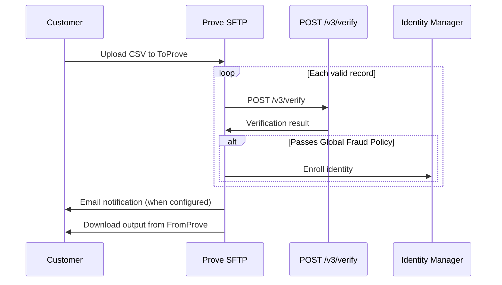

## Scope

Batch **Human Assurance** verification through Connect: upload CSV to **`ToProve`**, Prove calls `POST /v3/verify` with **`verificationType`: `humanAssurance`**, and enrolls rows that pass the Global Fraud Policy in Identity Manager.

For realtime request and response semantics, see Human Assurance Verify. For continuous monitoring after enrollment, see Human Assurance Manage. For the Verified User batch contract, see Verified User Connect.

Connect is the Prove Platform **batch verification** interface. Customers upload CSV files over **SFTP**. Connect verifies each valid row with **`POST /v3/verify`**. Connect enrolls rows that pass the **Global Fraud Policy** in **Identity Manager**. Output columns align with synchronous verify responses. Interpret **`Authentication Result`**, **`Risk Result`**, and assurance fields using the Global Fraud Policy and your product verify guide.

:::info
Connect supports **`verifiedUser`** and **`humanAssurance`**.
:::

## Scope details

| Item | Specification |
|------|----------------|
| Transport | SFTP to dedicated directories, `ToProve` / `FromProve` |
| Verification | `POST /v3/verify` per valid detail row |
| Enrollment | Rows that pass the Global Fraud Policy enrolled in Identity Manager |
| Result shape | Verify response fields mapped to output CSV columns, [see output file format](#output-file-format) |

## Provisioning

Prove provides the following items during onboarding. Some correspond to fields in the input file. See [Input file format](#input-file-format).

| Credential | Description |
|------------|-------------|
| Enroll Key | Validates file authenticity in the header record |
| Verification Type | `verifiedUser` or `humanAssurance` |
| Directory Paths | `ToProve` for uploading and `FromProve` for downloading |
| Authentication requirements | Hostname, port, username, and password |

:::info
Give your Pretty Good Privacy (PGP) public key to Prove during onboarding if you encrypt files at rest for SFTP transfer. Prove confirms cipher and key requirements in your onboarding package.
:::

**Partner metadata**

Some contracts require **Attribute Type**, **Issuer ID**, and **Attribute Value** on each detail row. **Partner** here means integrations that supply a non-PII client identifier and issuer metadata alongside the phone number, as agreed during onboarding.

## Processing

Batch processing follows this sequence:



| Stage | Behavior |
|-------|----------|
| Upload | Place your CSV in the provisioned **`ToProve`** directory via SFTP. |
| File validation | Prove validates file structure, header **Enroll Key**, header **Verification Type**, trailer record count, and naming convention. Failures reject the **entire file**. Prove writes a rejection artifact to **`FromProve`**. |
| Row validation | Prove checks each detail row for required fields, phone format and country code, and region consistency with the file **`region`**. Invalid rows go to a separate [error file](#error-file-format). |
| Verification | Prove sends rows to **`POST /v3/verify`**. Response fields align with the live API. |
| Enrollment | Prove enrolls rows that pass the Global Fraud Policy in Identity Manager. |
| Delivery | When processing completes, Prove sends an **email** notification when configured. The output file is available under **`FromProve`**. |

### File-level rejection

Prove rejects the **entire upload** when any of the following fail:

| Check | Typical cause |
| --- | --- |
| Enroll Key | Header key doesn't match provisioning |
| Verification Type | Header or filename `verification_type` doesn't match your contract |
| File structure | Missing or malformed Header, Column header, Detail, or Trailer records |
| Trailer count | **`Number of Records`** doesn't match detail row count |
| Naming convention | Filename doesn't match [Naming convention](#naming-convention) |

Download the rejection artifact from **`FromProve`** and fix the file before re-uploading.

## File requirements

Input and output CSVs use the following structures. File names must follow the naming pattern.

### Naming convention

**Input upload:**

`{client_name}_{region}_{verification_type}_YYYYMMDDHHMMSS.csv`

| Field | Values | Description |
|-----------|--------|-------------|
| `client_name` | Agreed during setup | Organization identifier |
| `region` | `US` or `INTL` | `US` for US and Canada. `INTL` for international. |
| `verification_type` | `verifiedUser` or `humanAssurance` | Must match header **Verification Type** and your contract |

**Output and error files** in **`FromProve`** use the same `client_name`, `region`, `verification_type`, and timestamp as the input file, with these suffixes before `.csv`:

| Artifact | Filename pattern |
| --- | --- |
| Success output | `{client_name}_{region}_{verification_type}_YYYYMMDDHHMMSS_output.csv` |
| Row validation errors | `{client_name}_{region}_{verification_type}_YYYYMMDDHHMMSS_error.csv` |
| File-level rejection | `{client_name}_{region}_{verification_type}_YYYYMMDDHHMMSS_reject.csv` |

Confirm suffixes with your Prove onboarding contact if your environment uses a different convention.

### Input file format

Each batch file uses a **Header → Column header → Details → Trailer** layout so Prove can validate the service type and record count.

#### Header record

| Field | Example value | Required |
|--------|-------------|----------|
| Record Type | `H` | Yes, always `H` |
| Enroll Key | `SecretKey` | Yes |
| Verification Type | `verifiedUser` or `humanAssurance` | Yes |

#### Column header record

Optional row that names CSV columns for detail records. **`Record Type`** is `C` when present.

| Description | Example header text |
|-------------|---------------------|
| Record Type | `C` |
| Phone number, E.164 with country code | `phoneNumber` |
| First name | `firstName` |
| Last name | `lastName` |
| Client customer identifier | `clientCustomerId` |
| Attribute type | `customerIDType` |
| Issuer ID | `customerIDProvider` |
| Attribute value | `customerId` |
| Miscellaneous optional columns | `email`, `ssn`, `address`, or other agreed names |

#### Detail records

| Field | Example value | Required | Description |
|--------|-------------|----------|-------------|
| Record Type | `D` | Yes, always `D` | |
| Phone Number | `+12008040444` | Yes | Include country code |
| First Name | `John` | Yes for `verifiedUser`, no for `humanAssurance` | See product Connect page |
| Last Name | `Doe` | Yes for `verifiedUser`, no for `humanAssurance` | See product Connect page |
| Client Customer ID | `zaq12wsx` | No | |
| Attribute Type | `userId` | Yes for partner contracts | Metadata type for the attribute value |
| Issuer ID | `AcmeWallet` | Yes for partner contracts | Partner or issuer name |
| Attribute Value | `A4B1F13BCCFC` | Yes for partner contracts | Non-PII unique value for the consumer |

#### Trailer record

| Field | Example value | Required |
|--------|-------------|----------|
| Record Type | `T` | Yes, always `T` |
| Number of Records | `132789` | Yes, must equal detail row count |

:::info
There is **no formal cap** on input file size or detail record count per file. When splitting work across uploads, Prove recommends **800,000 detail records or fewer per file**. Verification throughput is subject to **Data Partner transactions-per-second (TPS)** limits. **Completion time** varies with detail record count and effective throughput.
:::

#### Example input file

```csv
H,ENROLL_KEY_US_123,verifiedUser
C,phoneNumber,firstName,lastName,clientCustomerId,customerIDType,customerIDProvider,customerId,email,ssn,address
D,+12008040444,Sara,Hu,xsw23edc,userId,AcmeWallet,A4B1F13BCCFC
D,+12005551234,John,Doe,abc12345,,,
T,2
```

### Output file format

After processing, Prove writes an **output** CSV to **`FromProve`**. It mirrors the input layout and appends verification fields. Rows that failed **validation** before verify appear in the [error file](#error-file-format) instead.

#### Header record

| Field | Example value | Notes |
|--------|-------------|-------|
| Record Type | `H` | Always `H` |

#### Detail records

Appended columns follow the input columns for that row, then:

| Field | Example value | Notes |
|--------|-------------|-------|
| Record Type | `D` | Always `D` |
| Phone Number | `+12008040444` | From input |
| First Name | `John` | From input, when present |
| Last Name | `Doe` | From input, when present |
| Client Customer ID | `zaq12wsx` | If present on input |
| Attribute Type | `userId` | If present on input |
| Issuer ID | `AcmeWallet` | If present on input |
| Attribute Value | `A4B1F13BCCFC` | If present on input |
| Assurance Level | `AL2` | When verify succeeds |
| Assurance Level Reason Codes | `AL2a`, `AL2b` | When verify succeeds |
| Prove Phone Alias | `474628DC4VK83842DB25DA4B1F13BCCFC0MEK4P664Z9PCC6E6C3CB92DC40191E5E868E5E38B1AC85F6G359B74880097B63C51E7E8636B33FA344CB8E` | When verify succeeds |
| ProveID | `6b942541-abab-40ed-9970-5a28217836c0` | When verify succeeds |
| Error | `200` | HTTP status from the verify call for that row. For example, `200`, when the API accepted the request. |
| Error Message | `NA` | `NA` when no transport or platform error, otherwise error text from the verify response |
| Authentication Result | `pass` | From `evaluation.authentication.result` when present |
| Risk Result | `pass` | From `evaluation.risk.result` when present |

Row-level verify failures still appear in the output file with **`Authentication Result`** / **`Risk Result`** and assurance fields populated from the verify response. See Global Fraud Policy for failure reason codes.

:::info
Prove only includes the top-level identity in the output.
:::

#### Trailer record

| Field | Example value | Notes |
|--------|-------------|-------|
| Record Type | `T` | Always `T` |
| Number of Records | `2` | Detail row count in this file |

#### Example output file

```csv
H
D,+12008040444,Sara,Hu,xsw23edc,userId,AcmeWallet,A4B1F13BCCFC,AL2,AL2a|AL2b,474628DC4VK83842DB25DA4B1F13BCCFC0MEK4P664Z9PCC6E6C3CB92DC40191E5E868E5E38B1AC85F6G359B74880097B63C51E7E8636B33FA344CB8E,6b942541-abab-40ed-9970-5a28217836c0,200,NA,pass,pass
D,+12005551234,John,Doe,abc12345,,,,AL0,,,,200,NA,fail,pass
T,2
```

### Error file format

Prove writes rows that fail **row validation** to a separate **error** CSV under **`FromProve`**, with machine-readable codes in **Error Attribution**.

| Error Code | Description |
|------------|-------------|
| `ERR_MISSING_FNAME` | First name is missing when required |
| `ERR_MISSING_LNAME` | Last name is missing when required |
| `ERR_MISSING_PHONE` | Phone number is missing |
| `ERR_FORMAT_PHONE` | Invalid phone number format |
| `ERR_PHONE_COUNTRY_NOTSUPPORTED` | Phone country not supported |
| `ERR_DUPLICATE_RECORD_ORIGINAL_PRESERVED` | Duplicate record detected |

:::warning
US phone numbers must not appear in international-region files, and international numbers must not appear in US-region files.
:::

#### Header record

| Field | Example value | Notes |
|--------|-------------|-------|
| Record Type | `H` | Always `H` |
| Verification Type | `verifiedUser` or `humanAssurance` | |

#### Detail records

| Field | Example value | Notes |
|--------|-------------|-------|
| Record Type | `D` | Always `D` |
| Phone Number | `+12008040444` | |
| First Name | `John` | |
| Last Name | `Doe` | |
| Client Customer ID | `zaq12wsx` | If present on input |
| Error Attribution | `ERR_MISSING_FNAME` | Validation code for this row |

#### Trailer record

| Field | Example value | Notes |
|--------|-------------|-------|
| Record Type | `T` | Always `T` |
| Number of Records | `1` | Error detail row count |

#### Example error file

```csv
H,verifiedUser
D,+12008040444,,Hu,xsw23edc,ERR_MISSING_FNAME
T,1
```

## Notifications

### Email alerts

| Event | Email sent | Body |
|-------|------------|------|
| File rejected | Yes, when configured | Rejection details per onboarding configuration |
| File processed successfully | Yes, when configured | Includes **data quality statistics** |
