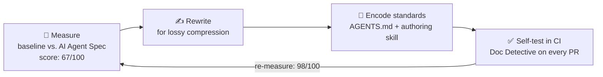

# Case Study: Making Developer Docs AI-Ready

**Role:** Technical Product Writer, Prove &nbsp;·&nbsp; **Scope:** Prove's public developer platform docs site, read by engineers integrating identity-verification APIs and SDKs

## The problem

The wake-up call was a high-profile client whose integration stalled — not because their developers were stuck, but because their AI coding agent was. It was working from bad context, and our documentation was the source.

Developers had stopped reading docs the way docs were written to be read. Integration questions increasingly arrived through AI coding assistants — an LLM would fetch our pages, compress them, and act on what survived. Content that looked polished to a human was failing its second audience: prose-heavy pages lost critical facts in summarization, error tables named the failure but not the fix, and inconsistent structure made retrieval a guessing game.

We needed documentation that worked equally well for a developer skimming at 2 a.m. and an agent parsing HTML-to-text.

## What I did

**Measured first.** I baselined our public platform docs site against Dachary Carey's [Agent-Friendly Documentation Spec](https://github.com/agent-ecosystem/agent-docs-spec) — an open standard that checks how well a docs site serves AI agents across seven categories, from content discoverability and clean Markdown availability to page size and URL stability. Scored with [Mintlify's Agent Score tool](https://www.mintlify.com/score), which implements the spec, we started at **67 out of 100**: pages that compressed badly, lookups that failed, instructions an agent couldn't execute.

**Rewrote for lossy compression.** The core insight: agents don't read pages, they read what's left after summarization. That reshaped concrete writing rules:

- **Examples over prose.** Stripping code examples degrades LLM task performance far more than stripping parameter descriptions — so examples became load-bearing, with inline comments stating intent (correct usage vs. near-miss).
- **Every error pairs cause with resolution.** An error code with only a description is a dead end for both audiences. Each entry now answers "what went wrong" *and* "what do I do next."
- **Stable headings, unified terminology, comparison tables.** Tables survive HTML-to-text conversion; clever section names don't.
- **No single source of truth in explanation pages.** Critical facts are duplicated into the reference and how-to pages where agents actually look them up.

You can see these patterns in the [documentation samples on this site](https://papadewald86.github.io/portfolio/docs/): troubleshooting tables that pair every symptom with a cause and a fix, tutorials with a checkpoint after every step, and reference pages built for lookup rather than reading.

**Encoded the standards so they'd outlive me.** The rules live in the repo as agent-readable conventions (AGENTS.md and a documentation-writer skill), so both human writers and AI tools produce compliant content by default. Diátaxis type is inferred from folder path — no one has to remember the framework to follow it.

**Made the docs self-testing.** Doc Detective tests run inline in the MDX: every documented API call, install command, and link is executed in CI. If the docs drift from reality, the build fails before a developer — or an agent — acts on stale instructions.

## Results

:::tip[📊 Outcomes]

- **98/100 AI Agent Score** across the developer site
- **30% reduction in developer onboarding time**, driven by reference redesign and contextual examples
- AI-ready patterns **adopted by product teams beyond docs**
- Documentation that ships through the same docs-as-code pipeline as the product, with tests as the safety net

:::

## What I took away

Writing for AI agents didn't compete with writing for humans — it enforced the discipline human readers always benefited from: front-loaded outcomes, working examples, recoverable errors, and structure you can trust. It turns out writing for LLMs isn't a complete overhaul — it's just writing for another persona.
