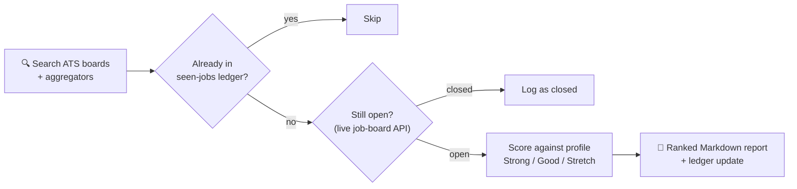

# Project: A Self-Verifying Job-Search Agent

**Stack:** Claude Code scheduled routine · web search · ATS job-board APIs (Greenhouse, Lever, Ashby) &nbsp;·&nbsp; **Artifact:** one self-contained prompt

## The problem

Job hunting has a daily chore at its core: search the same boards, skim the same aggregators, and try to remember what you've already seen. Two things make it worse than it looks:

- **Search indexes are full of ghosts.** Aggregators and search engines keep serving postings that closed weeks ago. On this agent's first run, **14 promising listings from search results turned out to be already closed** — only 3 survived verification.
- **Keyword matching flatters you.** A posting that names your tools isn't a posting you're qualified for. Deciding *fit* requires knowing what you don't have, not just what you do.

## What I built

A scheduled Claude Code routine — the entire system is a single, self-contained prompt that runs every morning. No code to deploy; the document *is* the program.



Three design decisions do the real work:

**Verify before reporting.** The agent never trusts a search result. Before a listing reaches the report, it's checked against the company's own job-board API (Greenhouse, Lever, and Ashby all expose public JSON endpoints). Dead listings get logged, not reported — so the daily report only ever contains jobs that are actually open.

**Score against gaps, not just skills.** The prompt encodes a structured profile that includes an explicit list of qualifications I *don't* have. Every match is rated Strong, Good, or Stretch, with the specific gaps named per listing — an integrity rule in the prompt forbids inflating fit to make a posting look better.

**Remember across runs.** A dedupe ledger (one Markdown file, one line per posting) persists between runs, so each report contains only new findings. The agent reads it first and appends to it last.

## Why a prompt instead of a script

I could have written this as a scraper. But the interesting parts — reading a JD, judging fit against a nuanced profile, writing a useful summary — are language tasks, not parsing tasks. The scheduled-routine format means the whole system is **a document under version control of its own behavior**: changing what the agent looks for, or how honestly it scores, is an edit to prose. For a technical writer, that's the point — this is documentation that executes.

## The template

The sanitized version of the routine's prompt, with personal details replaced by placeholders:

<details>
<summary>Full routine prompt (template)</summary>

```markdown
You are running a daily job-posting search for <NAME> (<EMAIL>), a <ROLE>
in <TIMEZONE> actively job hunting. Find NEW postings matching their profile,
score them honestly against their real background, and write a report.

## Target roles
Search for these titles: <TITLE 1>, <TITLE 2>, ... Also include close variants
when the JD substance matches. Full-time. <REMOTE/LOCATION PREFERENCES>.
Ignore <EXCLUSIONS — e.g., short contracts, roles without technical depth>.

## Their real background (score against this — never assume more)
- <Current role, company, tenure, and scope>
- <Concrete skills with evidence: tools, languages, platforms>
- <Notable wins with numbers>
- <Certifications and education>

## Honest gaps (flag these when a JD asks for them — never paper over)
<The qualifications they DON'T have: tools never used, experience thresholds
not met, work they've never done. This list is what keeps scoring honest.>

## Sources (use web search; do NOT attempt to scrape LinkedIn/Indeed/Glassdoor)
Run several searches such as:
- site:boards.greenhouse.io ("<title>" OR "<title>") remote
- site:jobs.lever.co ("<title>") remote
- site:jobs.ashbyhq.com ("<title>")
Fetch promising results to read the actual JD before scoring. Prefer postings
from the last ~7 days. Verify each listing is still open against the company's
live job-board API (boards-api.greenhouse.io, api.lever.co,
api.ashbyhq.com/posting-api) before reporting it.

## Dedupe
Read <PATH>/seen-jobs.md first (create it if missing). Skip anything already
listed. After reporting, append each posting as:
`- YYYY-MM-DD | Company | Title | URL`

## Output
Write a Markdown report to <PATH>/reports/job-matches-YYYY-MM-DD.md. Cap at
the 10 best NEW matches. For each: title, company, link, location/remote
policy, salary if listed, a fit rating (Strong / Good / Stretch), 2–3
sentences on why it fits their actual experience, and an honest "Gaps" line
naming any required or preferred quals they lack. Sort best-fit first. End
with a one-line tally. If nothing new is found, still write the report —
an empty day is a valid result.

Integrity rule: never inflate qualifications to make a posting look like a
better fit, and never invent postings — every entry must link to a real,
currently-open listing you actually fetched.
```

</details>

## Results

:::tip[📊 First-run outcomes]

- **25+ postings reviewed, 14 verified as already closed** — ghosts that manual searching would have chased
- **3 verified-open matches reported**, one rated Strong — which became a real application the same day
- Zero duplicate findings on subsequent runs, thanks to the ledger

:::

## What I took away

The verification step is the whole game. An agent that reports unverified search results is just a slower way to be disappointed — the value came from encoding *distrust* of the index and *honesty* about fit directly into the instructions. That's the same discipline as good documentation: the artifact is only trustworthy if it's tested against reality before it ships.
